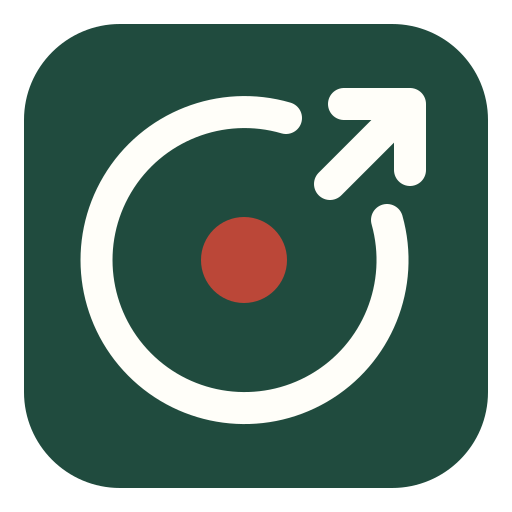
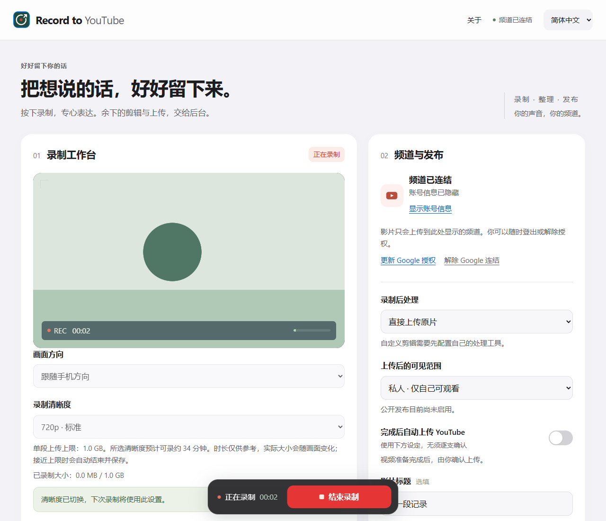

<p></p>

# 今日录制 · Record to YouTube

在 Windows 电脑上录制视频，保存原片，并自动上传到自己的 YouTube 频道。默认直接上传原片；需要剪辑时，可接入自己的工具或 Codex Skill。云服务器是可选项。

Record locally, upload to your own YouTube channel, and optionally edit with your own tools or Skills. [English guide](README.en.md).

当前为 **0.1.0 公开预览版**。[下载版本](https://github.com/FaYuaner/record-to-youtube/releases) · [更新记录](CHANGELOG.md) · [安装与升级](docs/INSTALLATION.md)



截图使用示例摄像头与示例频道，展示实际录制界面。结束录制后，原片可保存到本机队列；自动上传可以关闭。[查看保存后的录制列表](docs/images/saved-recording.png)。

## 主要功能

- 摄像头和麦克风预览、设备选择、画质与画面方向设置，支持背景分割。
- 原片先保存在本机，录制中分段保存恢复副本；支持导入视频。
- 本机上传队列、YouTube 断线续传、暂停、继续，以及实际处理状态。
- 默认录制结束后自动上传，初始可见范围为私人；可关闭自动上传，先预览再上传。
- 三种处理方式：直接上传原片、自定义剪辑 / Skill、内置停顿剪辑与转录。
- 自定义处理失败或超时会停止上传，保留原片；不使用未经完成的剪辑结果。
- 简体中文、繁体中文、英文界面，Windows 桌面入口与录制条。

适合希望自己管理录制资料、剪辑方法和频道授权的创作者。每台安装使用自己的 Google 凭据、工具和配置。

## 快速开始录制

需要 Windows、Google Chrome 和 Python 3.11 或 3.12。直接录制不需要 FFmpeg、AI 服务或远程服务器。

```powershell
git clone --branch v0.1.0 https://github.com/FaYuaner/record-to-youtube.git
cd record-to-youtube
powershell -NoProfile -ExecutionPolicy Bypass -File desktop/Install-Local.ps1
```

双击 `desktop/Start-Recorder.vbs`。桌面入口会启动仅监听本机的工作台。选择摄像头、麦克风和原片保存资料夹，录一段短视频，结束后检查原片。

尚未连接 YouTube 时，视频只保留在本机；连接后可从列表准备上传。原片完整保存到本机队列后，可以关闭网页，保持电脑运行即可继续处理和上传。

## 连接自己的 YouTube

1. 在 [Google Cloud Console](https://console.cloud.google.com/) 新建自己的项目，启用 **YouTube Data API v3**。
2. 在 **Google Auth Platform** 设置受众和 OAuth 信息；测试阶段将自己的 Google 账号加入测试用户。
3. 在 **Clients / 客户端** 新建 **Desktop app / 桌面应用**，下载 OAuth JSON，放在自己的私人目录。
4. 复制 `desktop/local.env.example` 为 `desktop/local.env`，将 `GOOGLE_CLIENT_SECRET_FILE` 设置为该 JSON 的绝对路径。关闭已有本机服务后，重新打开桌面入口。
5. 点击“连接 Google 账号”，确认自己的频道并完成授权。

首次授权绑定当前安装的账号与所选频道。上传设置会明确显示自动上传和可见范围；每次录制沿用开始录制时的选择。YouTube 最终可见范围以平台返回为准。Google OAuth 测试模式和未经审核的 YouTube API 项目存在授权期限、上传私人限制与配额规则。

详见 [配置指南](docs/CONFIGURATION.md)。远程服务器的 Web OAuth JSON 与桌面凭据使用不同的授权方式。

## 按自己的方法剪辑

默认选择“直接上传原片”，标题留空时使用录制文件名，简介可以留空。

要让自己的 Skill 负责剪辑，先安装并登录自己的 Codex CLI，在私人配置中指定 Skill 和处理命令。项目提供 [Codex Skill 适配器](examples/codex_skill_adapter.py) 和 [FFmpeg 转码示例](examples/ffmpeg_tool.py)。在界面选择“自定义剪辑 / Skill”后，处理工具成功返回并通过成片验证才会上 YouTube。

完整接入说明、输入输出协议与示例见 [自定义剪辑](docs/CUSTOM_EDITING.md)。Skill 文件是处理要求，必须由对应工具执行；使用自己的 AI 工具可能消耗其额度。

## 可选服务器模式

设置 `desktop/recorder.config.json` 的 `mode` 为 `remote` 并填写自己部署的 HTTPS 地址，即可使用远程工作台。云端可继续运行内置停顿剪辑、转录及文案生成，也可选择直接上传或自定义工具。

- [服务器部署](docs/DEPLOYMENT.md)
- [Windows 使用说明](desktop/使用說明.md)
- [开发与贡献](CONTRIBUTING.md)

## 使用条件

- 本机模式的录制与上传资料保存在当前用户的本机目录；不同安装分别配置。不要让多个服务共享数据目录。
- 页面关闭后队列仍可运行；关闭服务、关机或休眠会暂停工作，重新启动后恢复。
- 外部剪辑和内置媒体处理需要 FFmpeg / ffprobe；内置转录另需语音模型，文案生成另需自己的 AI 配置。
- 重要原片请保留独立备份。浏览器恢复副本不能代替原片备份。
- Google、YouTube、AI 服务的权限、审核、额度和费用由各平台管理。

## 开发检查

```powershell
python -B tests/run_offline.py
powershell -NoProfile -File tests/desktop_settings_tests.ps1
```

默认检查使用隔离数据与模拟外部请求；测试范围见 [测试说明](docs/TESTING.md)。MediaPipe 运行资源及 Apache License 2.0 保留在项目中，其他依赖遵守各自许可，见 [第三方依赖](docs/THIRD_PARTY_NOTICES.md)。

安装使用固定版本与哈希校验，维护方法见 [依赖说明](docs/DEPENDENCIES.md)。问题反馈使用 [报告表单](https://github.com/FaYuaner/record-to-youtube/issues/new/choose)，安全问题请按 [安全报告](SECURITY.md) 处理。

## 许可证

本项目原创代码与文档采用 [MIT 许可证](LICENSE)，允许使用、修改、分发和商业使用，须保留版权与许可声明。第三方组件继续遵循各自许可证，详见 [第三方依赖](docs/THIRD_PARTY_NOTICES.md)。
